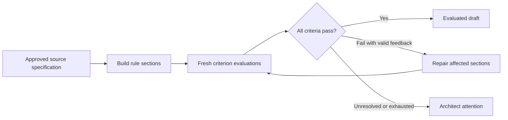

# Architecture

We use Python, LangGraph for explicit workflow control, and LangChain for model access and structured outputs. The current application is a local CLI. Model choices remain case by case: focused workers will usually use smaller models; research, review, or orchestration may justify larger ones.

## Workflow

Known transitions are defined in code. We do not add an LLM supervisor for this fixed workflow. A model-based orchestrator can be introduced when tasks require dynamic decomposition.

## Boundaries

- Source models define a reusable rule catalog and project profiles that pin adopted pack versions. Composition produces baseline, project, and enterprise layers with rules, criteria, and references. Duplicate IDs, unapproved layers, declared conflicts, mismatched versions and project scopes are rejected. Layers never silently overwrite each other.
- Builders receive one rule and its integration references. Repairs receive that section and relevant failure findings. Builders cannot edit the source specification, rubric, or other rule sections.
- Evaluators receive the candidate sections and approved rules relevant to one criterion. Composed consistency receives all adopted sections. Each call starts with fresh messages and a newly constructed model; previous verdicts and builder claims are excluded.
- The workflow verifies cited quotes against actual candidate sections. Passes require evidence for each applicable rule; failures require actionable feedback with valid repair targets. Invalid results and provider failures become unresolved results. Quote validation proves the text exists, not that the judge's interpretation is correct.
- Rendering is deterministic. Run records preserve source snapshots, candidate revisions and hashes, per-criterion evidence, backend identity, workflow/prompt versions, and configured limits.

Updates reuse sections only when their rules and associated documentation references are unchanged. Every update receives a new source hash and complete evaluation. Failures trigger targeted repairs, followed by another full evaluation. Unchanged repairs stop for attention.

## Execution controls and current limits

Repair rounds, backend calls, and elapsed time are bounded. CLI model calls have an output-token cap, a request timeout, and automatic provider retries disabled. The elapsed-time budget is checked between calls; it cannot forcibly interrupt a running provider call. Monetary quotas and precise token accounting remain future work.

Models receive no filesystem, shell, publication, or network-retrieval tools from this workflow. Documentation URLs are references only; their contents are not fetched. Prompts separate evaluation instructions from candidate data, but this does not prove resistance to prompt injection. Semantic conflicts and judge quality need calibrated evaluation fixtures.

Passing all current criteria yields an evaluated draft, never an approved or automatically installed agent. The offline backend verifies source copying solely to demonstrate control flow. Real coding-tool behavior still requires isolated scenarios using the intended tool and model.

This is a single-user local prototype. Project scope checks are not multi-user authorization; source approval flags and prior run files are trusted local inputs. Storage is local JSON/Markdown, without durable graph checkpoints or resume support. Do not supply secrets in specifications or enable external tracing for confidential data without a data-handling decision.

## Inspiration

[GitHub Spec Kit's constitution template](https://github.com/github/spec-kit/blob/main/templates/constitution-template.md) informs our named principles, governance, and revision tracking. We use structured source records rather than importing its command workflow.

[LangGraph's graph model](https://docs.langchain.com/oss/python/langgraph/graph-api) supplies explicit state and transitions. [Anthropic's evaluator–optimizer guidance](https://www.anthropic.com/engineering/building-effective-agents) informs bounded feedback loops, and its [evaluation guidance](https://www.anthropic.com/engineering/demystifying-evals-for-ai-agents) informs evidence, isolated behavioral trials, and human calibration. These references guide our design; they do not certify this implementation.
